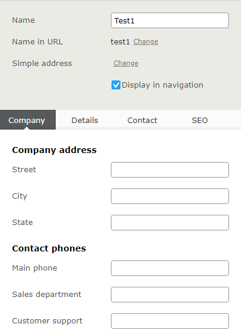
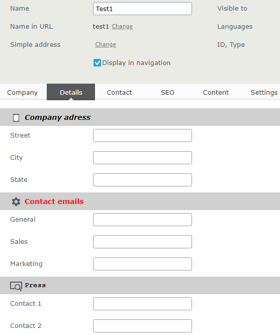
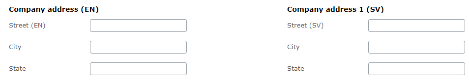

# Grouping Header

This add-on is to allow to group several properties together.
It will display header above the first property from the group.
Headers are defined using GroupingHeaderAttribute which has Title parameter. 
The attribute should be used on the first property from the group. 

## Basic usage

```c#
public class TestPage : SitePageData
{
    [GroupingHeader("Company address")]
    [Display(GroupName = "Company", Order = 1)]
    public virtual string AddressStreet { get; set; }

    [Display(GroupName = "Company", Order = 2)]
    public virtual string AddressCity { get; set; }
    
    [Display(GroupName = "Company", Order = 3)]
    public virtual string AddressState { get; set; }
	
    [GroupingHeader("Contact phones")]
    [Display(GroupName = "Company", Order = 4)]
    public virtual string PhoneMain { get; set; }
 
    [Display(Name="Sales department", GroupName = "Company", Order = 5)]
    public virtual string PhoneSalesDepartment { get; set; }
 
    [Display(GroupName = "Company", Order = 6)]
    public virtual string PhoneCustomerSupport { get; set; }
}
```

For address properties it will be “AddressStreet” and for Phone properties it will be “PhoneMain”.


## Styling headers

Together with the Title you can set CssClass and Tag parameters. 
Using those settings you can customize header layout.



The styles need to be added to a css file and then injected into Edit Mode via module.config (example is in Alloy)

```css
.address-group, .emails-group, .press-group {
    background-color: #d0d0d0;
}
 
.address-group > h3:before, .emails-group > h3:before, .press-group > h3:before {
    content: " ";
    display: inline-block;
    width: 24px;
    height: 24px;
    float: left;
    margin-right: 5px;
    background: url(/EPiServer/Shell/11.1.0.0/ClientResources/epi/themes/sleek/epi/images/icons/commonIcons24x24.png) 0 -288px no-repeat;
}
 
.address-group > h3 {
    font-style: italic
}
 
.emails-group > h3 {
    color: red;
}
 
.emails-group > h3:before {
    background-position-y: -192px;
}
 
.press-group > h3 {
    font-family: "Courier new"
}
 
.address-group > h3:before {
    background-position-y: -96px;
}
```

## Localizing header title

You can also translate the title using resource files. It’s similar to translating property caption. The resourcekey format for header is
“contentType / [type name] / properties / [property name] / groupingheader“.
For example to translate property “testg11” from “TestPage” page, the XML will look like:

```xml
<?xml version="1.0" encoding="utf-8"?>
<languages>
  <language name="English" id="en">
    <contenttypes>
      <!-- TestPage -->
      <testpage>
        <properties>
          <testg11>
            <groupingheader>Company address (EN)</groupingheader>
            <caption>Street (EN)</caption>
          </testg11>
        </properties>
      </testpage>
	  
	  <!-- Other properties -->
 
    </contenttypes>
  </language>
</languages>
```



## Setup the Development Environment
1. Run `setup.cmd`
2. Build the solution in Visual Studio

Once the environment is setup, you can press `CTRL-F5` in Visual Studio to start the sample site.
